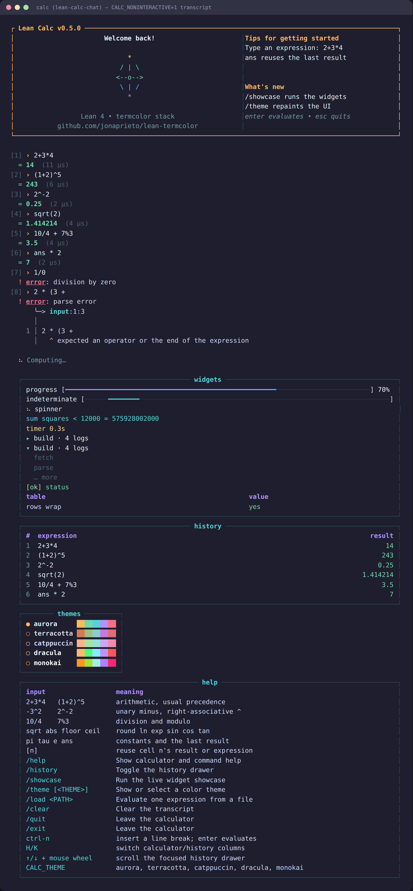

# lean-calc-chat

[](https://github.com/jonaprieto/lean-calc-chat/actions/workflows/ci.yml)
[](https://github.com/jonaprieto/lean-calc-chat/releases)
[](lean-toolchain)
[](https://jonaprieto.github.io/lean-calc-chat/)
[](LICENSE)

Chat-shaped terminal calculator in Lean 4. It combines [Grip parsing](https://github.com/jonaprieto/lean-grip), pure [TermColor rendering](https://github.com/jonaprieto/lean-termcolor),
diagnostics, widgets, terminal input, themes, history, and concurrent background evaluations.

<p align="center"></p>

## Status and review

These libraries are actively evolving and are developed with AI assistance and human review.
CI and machine-checked proofs provide useful evidence, but do not guarantee correctness,
soundness, portability, performance, or suitability for every use case. Validate behavior
and assumptions before relying on a release.

Reviewer feedback is welcome, especially on correctness, proofs, API design, usability,
portability, performance, documentation, and real-world use. Please use the
[issue tracker](https://github.com/jonaprieto/lean-calc-chat/issues) or open a PR with a
reproducible example and the expected behavior.

## Run

```sh
lake build calc
lake exe calc
lake exe calc "2+3*4"
CALC_THEME=dracula lake exe calc
CALC_NONINTERACTIVE=1 lake exe calc
```

The default palette is `aurora`; `CALC_THEME` or `/theme` can select another palette.

On a TTY, `Enter` evaluates, `Esc` quits, arrow keys recall input history, `Tab` completes
commands, and `Ctrl-N` inserts a line break. Submitted expressions run independently; completed
results merge into the current transcript by cell, with evaluation time shown on each answer.
`/help`, `/history`, `/showcase`, `/theme`,
`/clear`, and `/quit` are available commands. `/history` toggles the side drawer when the window
is wide enough; uppercase `H` and `K` focus the calculator and history columns. With history
focused, arrow keys or the mouse wheel scroll it; clicking either pane changes focus.

Supported operators are `+ - * / % ^`; built-in functions include `sqrt`, `abs`, `floor`, `ceil`,
`round`, `ln`, `exp`, `sin`, `cos`, and `tan`. Constants include `pi`, `tau`, `e`, and `ans`.

## Build

```sh
lake build calc
CALC_NONINTERACTIVE=1 lake exe calc
```

`Calc.Eval` contains the byte parser and evaluator. `Calc.View` is pure width-aware rendering;
`app/Main.lean` owns terminal input and background job execution.

## Related projects

Built on [`grip`](https://github.com/jonaprieto/lean-grip),
[`grip-diagnostics`](https://github.com/jonaprieto/lean-grip-diagnostics),
[`termcolor-diagnostics`](https://github.com/jonaprieto/lean-termcolor-diagnostics),
[`termcolor-widgets`](https://github.com/jonaprieto/lean-termcolor-widgets),
[`termcolor-terminal`](https://github.com/jonaprieto/lean-termcolor-terminal), and
[`argus`](https://github.com/jonaprieto/lean-argus). [`termcolor-repl`](https://github.com/jonaprieto/lean-termcolor-repl)
supplies reusable input and job-loop primitives.

## License

Apache-2.0.
